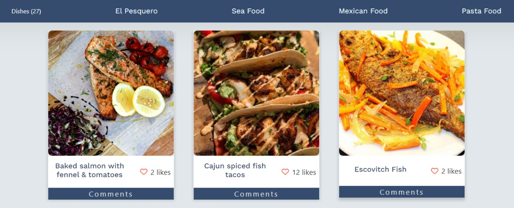
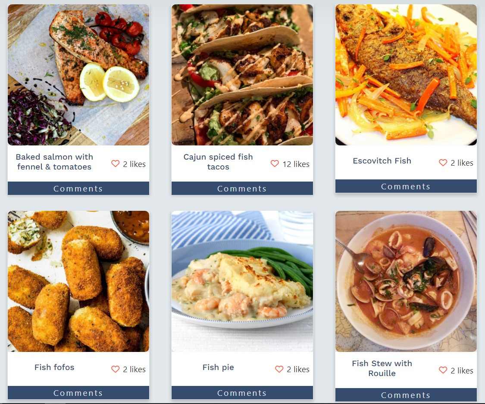

# El Pesquero Restaurant Web App

> An App that uses an external APIs to show meals from around the world.




This website displays recipes meals using APIs to retrieve details from a DataBase and also implements features like adding a functional Like button for every item and a section for adding a new comment. All these through an external API to send and receive data.

## Built With

- HTML
- CSS
- JavaScript
- WebPack
- Bootstrap
- Aos Animate Library
- [The Meal DB API](https://www.themealdb.com/api.php)
- [Ivolvement API](https://www.notion.so/Involvement-API-869e60b5ad104603aa6db59e08150270)

## Live Page

[Page Link](https://LuisSalas94.github.io/javascript-capstone-project/dist/)
<br>
[Video Link](https://drive.google.com/file/d/1VTg0KvMuPvTiFc5Ha43aP5RUsg8X2JD9/view?usp=sharing)


## Getting Started

To get a local copy up and running follow these simple steps.

### Prerequisites

- Have git correctly installed.
- Have NPM and NodeJs correctly installed.

### Setup

- Open a terminal window where you want to have installed a copy of the repository.

### Install

- Use this command to clone the repo:
```
$ git clone git@github.com:LuiSalas94/javascript-capstone-project.git
```
- Install the required dependencies:
```
$ npm install
```
### Usage

- Run:
```
$ npm start
```
- Build:
```
$ npm run build
```
- Testing:
```
$ npm test
```
- Edit the content as you like.


## Authors

👤 **Kenny Salazar**

- GitHub: [@helio3197](https://github.com/helio3197)
- Twitter: [@kennysalazar31](https://twitter.com/kennysalazar31)
- LinkedIn: [LinkedIn](https://linkedin.com/in/kenny-salazar-1a1687110)

👤 **Fernando Salas**

- GitHub: [@LuisSalas94](https://github.com/LuisSalas94)
- Twitter: [@FernandoSalasD4](https://twitter.com/FernandoSalasD4)
- LinkedIn: [LinkedIn](https://www.linkedin.com/in/luisfernandosalasgave/)


## 🤝 Contributing

Contributions, issues, and feature requests are welcome!

Feel free to check the [issues page](../../issues/).

## Show your support

Give a ⭐️ if you like this project!

## Acknowledgments

- Thanks to Microverse for the guidelines.


## 📝 License

This project is [MIT](./MIT.md) licensed.
